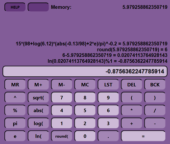

<div align="center">

# AK7Calc #
</div>

A very simple calculator built with the framework [Qt 6.2.2](https://www.qt.io/).


<br>
<div align="center">


</div>


## Help

```
DEL  delete expression, clear history if expression is empty
BCK  backspace (delete last character)
LST  return to last expression from history

MR   memory recall
M±   put current expression to memory with given sign
MC   memory clear
```
